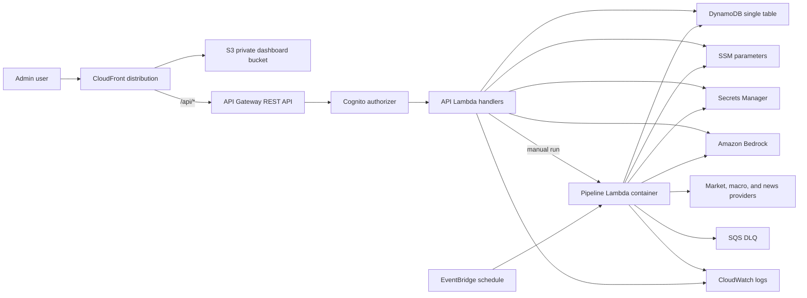
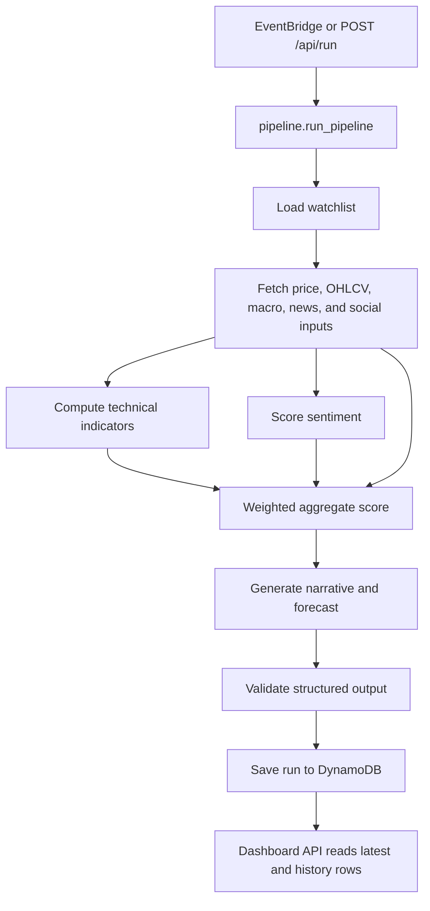

# SignalDesk AWS Architecture

## Overview

SignalDesk AWS is the serverless AWS port of the original local-first market
analysis prototype. The product still produces short-term market analysis for a
watchlist, but the runtime has moved to managed AWS infrastructure:

- Static dashboard on S3 and CloudFront.
- Same-origin `/api/*` calls through CloudFront to API Gateway.
- Cognito-protected private-admin API access.
- Python Lambda handlers for dashboard, ticker, watchlist, content, status, and manual run operations.
- Docker-image Lambda for the heavier scheduled market pipeline.
- EventBridge for scheduled runs.
- DynamoDB for run history, latest ticker state, watchlist config, and pipeline status.
- Secrets Manager for external API keys and webhooks.
- SSM Parameter Store for runtime settings and safety policy.
- Bedrock for AWS-native AI generation.

## Target Architecture



## Stack Split

| Stack | Resources | Notes |
| --- | --- | --- |
| `SignalDeskCoreStack` | DynamoDB table, Secrets Manager secret, SSM settings, SSM safety denylist, SSM allowed topics | Shared state and configuration |
| `SignalDeskPipelineStack` | Docker-image pipeline Lambda, EventBridge rule, SQS DLQ, Lambda log group | Schedule is disabled by default unless `SIGNALDESK_PIPELINE_SCHEDULE_ENABLED=true` |
| `SignalDeskApiStack` | Cognito user pool/client, API Gateway, route Lambdas, API log/metrics settings | All API routes require Cognito authorization |
| `SignalDeskDashboardStack` | S3 dashboard bucket, CloudFront distribution, dashboard deployment, `/api/*` origin routing | Dashboard bucket is private and served through origin access control |

## Runtime Components

| Component | Responsibility |
| --- | --- |
| `pipeline/runtime.py` | Selects local or AWS providers with `SIGNALDESK_RUNTIME` |
| `pipeline/storage_contract.py` | Storage interface shared by local and AWS runtimes |
| `pipeline/config_contract.py` | Settings and secrets interface |
| `pipeline/ai_client_contract.py` | AI generation interface |
| `pipeline/providers/local_storage.py` | Local SQLite-compatible provider |
| `pipeline/providers/dynamodb_storage.py` | DynamoDB provider for AWS |
| `pipeline/providers/local_config.py` | Local config provider |
| `pipeline/providers/aws_config.py` | SSM and Secrets Manager provider |
| `pipeline/providers/openai_client.py` | Local/provider fallback AI client |
| `pipeline/providers/bedrock_client.py` | AWS Bedrock AI client |
| `api/handlers/*` | Lambda handlers for API Gateway |
| `api/server.py` | Local FastAPI compatibility server |
| `pipeline/run_pipeline.py` | CLI and Lambda entrypoint for the pipeline |

## Data Flow



The aggregate score formula remains:

```text
aggregate_score = round(
    technical_score * 0.40 +
    sentiment_score * 0.35 +
    macro_score * 0.25
)
```

Weights are stored in the SSM settings parameter and can be changed without a
code deploy.

## DynamoDB Model

The port uses one DynamoDB table with `PK` and `SK` string keys.

| Entity | Key shape | Purpose |
| --- | --- | --- |
| Daily run | `PK=TICKER#{ticker}`, `SK=RUN#{yyyy-mm-dd}` | Full historical run payload for a ticker |
| Latest run | `PK=LATEST`, `SK=TICKER#{ticker}` | Fast dashboard and detail lookups |
| Watchlist | `PK=CONFIG`, `SK=WATCHLIST` | Admin-managed ticker list |
| Pipeline status | `PK=PIPELINE`, `SK=RUN#{run_id}` | Manual and scheduled run status tracking |

Run payloads are validated with `StoredRunPayload` before persistence.

## API Surface

| Route | Method | Handler | Purpose |
| --- | --- | --- | --- |
| `/api/status` | `GET` | `api.handlers.status.handler` | Health and latest run metadata |
| `/api/dashboard` | `GET` | `api.handlers.dashboard.handler` | Latest dashboard summary |
| `/api/watchlist` | `GET` | `api.handlers.watchlist.get_handler` | Read watchlist |
| `/api/watchlist` | `POST` | `api.handlers.watchlist.update_handler` | Update watchlist |
| `/api/run` | `POST` | `api.handlers.manual_run.handler` | Invoke pipeline Lambda |
| `/api/run/{run_id}` | `GET` | `api.handlers.run_status.handler` | Read pipeline status |
| `/api/ticker/{ticker}` | `GET` | `api.handlers.ticker_detail.detail_handler` | Full latest ticker detail |
| `/api/ticker/{ticker}/history` | `GET` | `api.handlers.ticker_detail.history_handler` | Historical chart rows |
| `/api/ticker/{ticker}/earnings-story` | `POST` | `api.handlers.content.earnings_story_handler` | First-pass earnings story |
| `/api/ticker/{ticker}/news-draft` | `POST` | `api.handlers.content.news_draft_handler` | First-pass news article |

## AI And Safety

AWS mode uses Bedrock through `pipeline/providers/bedrock_client.py`.
OpenAI remains available through `pipeline/providers/openai_client.py` for local
or alternate-provider development.

The finance-only safety path applies to sentiment, analysis, earnings story, and
news draft generation:

1. Validate request fields with Pydantic schemas.
2. Reject off-topic requests.
3. Reject prompt-injection patterns and attempts to reveal prompts, policies, secrets, or credentials.
4. Reject denied terms from SSM-configured safety policy.
5. Construct prompts from typed validated fields only.
6. Require JSON model output.
7. Validate output with Pydantic.
8. Attempt one JSON repair before fallback or rejection.

API handlers convert safety failures into structured 400 responses.

## Secrets And Configuration

| Store | Contents |
| --- | --- |
| Secrets Manager | FRED API key, NewsAPI key, Discord webhook URL, optional OpenAI API key |
| SSM settings parameter | Bedrock model ID, generation settings, pipeline weights, lookback days, forecast days, news item limits, default watchlist |
| SSM denylist parameter | Forbidden terms/content policy |
| SSM allowed topics parameter | Finance-topic allowlist |
| Lambda environment | Resource names, runtime mode, Bedrock model ID |

No live secret-bearing local config files are packaged into Lambda assets.

## Observability And Failure Handling

- API Gateway has metrics enabled and INFO logging configured.
- Every Lambda has a CloudWatch log group with one-week retention.
- The pipeline Lambda has an SQS dead-letter queue with 14-day retention.
- Pipeline runs write status records to DynamoDB with processed, failed, failure details, and completion timestamps.
- Bedrock generation failures use deterministic fallback content where appropriate.

## Deployment Flow

1. Configure AWS credentials and `.env`.
2. Run `make PYTHON=/Users/emilygao/miniconda3/envs/dev/bin/python install`.
3. Run `make test`.
4. Run `make synth`.
5. Run `make deploy`.
6. Seed Secrets Manager with real external API keys and webhook URLs.
7. Create Cognito admin users.
8. Manually invoke the pipeline and check DynamoDB, CloudWatch logs, and dashboard API responses.
9. Enable the EventBridge schedule only after smoke tests pass.

## Verification

The primary local verification command is:

```bash
make test
```

Install dependencies with Python 3.12:

```bash
make PYTHON=/Users/emilygao/miniconda3/envs/dev/bin/python install
```

Coverage includes:

- Lambda handler behavior.
- DynamoDB data model behavior.
- Safety validator behavior.
- Local FastAPI compatibility.
- Storage and technical indicator logic.
- SIT-level smoke coverage.

Latest housekeeping SIT result: `173 passed, 3 warnings` on Python 3.12.12.

## Retained Local Compatibility

The port keeps local development possible. `api/server.py` still serves the
dashboard locally with FastAPI, and provider contracts allow local storage,
local config, and OpenAI-based generation when AWS mode is not selected.

The local-first runtime is now a development compatibility layer. The production
target is the AWS architecture described above.
