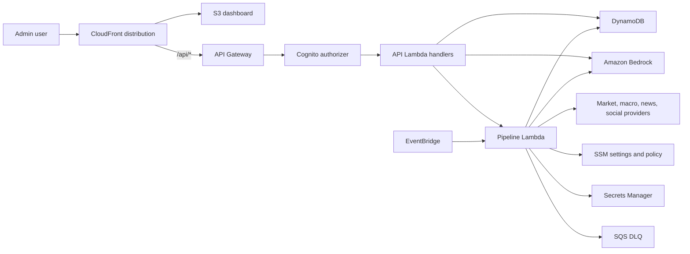

# Architecture

## 1. Purpose

SignalDesk AWS is the serverless AWS port of a local-first market analysis
prototype. It serves an authenticated admin dashboard for monitoring a watchlist,
running the analysis pipeline, reviewing ticker detail, and generating first-pass
editorial content.

## 2. Current System Shape

The runtime is split across four CDK stacks:

| Stack | Resources | Responsibility |
| --- | --- | --- |
| `SignalDeskCoreStack` | DynamoDB, Secrets Manager, SSM parameters | Shared state, runtime settings, secrets, and safety policy |
| `SignalDeskPipelineStack` | Docker-image Lambda, EventBridge rule, SQS DLQ | Scheduled and manual market analysis runs |
| `SignalDeskApiStack` | Cognito, API Gateway, Lambda handlers | Authenticated dashboard API |
| `SignalDeskDashboardStack` | S3, CloudFront, bucket deployment | Static dashboard and same-origin `/api/*` routing |



## 3. Component Map

| Component | Path | Responsibility | Key dependencies |
| --- | --- | --- | --- |
| CDK app | `infrastructure/app.py` | Creates and wires stacks | `aws-cdk-lib`, `constructs` |
| Core stack | `infrastructure/stacks/core_stack.py` | Shared table, secret, settings, safety params | DynamoDB, Secrets Manager, SSM |
| API stack | `infrastructure/stacks/api_stack.py` | Cognito, API Gateway, route Lambdas | Lambda, API Gateway, Cognito |
| Pipeline stack | `infrastructure/stacks/pipeline_stack.py` | Pipeline Lambda image, schedule, DLQ | Lambda, ECR assets, EventBridge, SQS |
| Dashboard stack | `infrastructure/stacks/dashboard_stack.py` | Static dashboard hosting | S3, CloudFront |
| API handlers | `api/handlers/` | Lambda route handlers | Provider contracts, DynamoDB, Bedrock |
| Local API server | `api/server.py` | FastAPI compatibility server for local development | FastAPI |
| Pipeline entrypoint | `pipeline/run_pipeline.py` | CLI and Lambda pipeline execution | Runtime providers |
| Runtime selector | `pipeline/runtime.py` | Chooses local or AWS providers | Environment variables |
| Storage contracts | `pipeline/storage_contract.py` | Storage interface | Local and DynamoDB providers |
| Config contracts | `pipeline/config_contract.py` | Settings and secrets interface | Local env, SSM, Secrets Manager |
| AI contracts | `pipeline/ai_client_contract.py` | AI generation interface | Bedrock and OpenAI providers |
| Safety layer | `pipeline/safety/` | Finance-topic validation and output schemas | Pydantic |
| Dashboard UI | `dashboard/index.html` | Authenticated admin dashboard | Cognito, same-origin API |

## 4. Runtime Flow

```text
EventBridge or POST /api/run
  -> pipeline Lambda
  -> load watchlist, settings, and secrets
  -> fetch price, macro, news, and optional social inputs
  -> compute technicals and sentiment
  -> call Bedrock for structured analysis/content where needed
  -> validate structured outputs through safety schemas
  -> write latest, history, watchlist, and run-status items to DynamoDB
  -> dashboard reads API responses through CloudFront /api/*
```

Manual content generation follows:

```text
Dashboard action -> API Gateway -> content Lambda -> DynamoDB latest run -> Bedrock -> validated JSON response
```

## 5. Data Flow

The DynamoDB table uses `PK` and `SK` string keys.

| Entity | Key shape | Purpose |
| --- | --- | --- |
| Daily run | `PK=TICKER#{ticker}`, `SK=RUN#{yyyy-mm-dd}` | Historical full run payload |
| Latest run | `PK=LATEST`, `SK=TICKER#{ticker}` | Fast dashboard and ticker detail lookups |
| Watchlist | `PK=CONFIG`, `SK=WATCHLIST` | Admin-managed ticker list |
| Pipeline status | `PK=PIPELINE`, `SK=RUN#{run_id}` | Manual and scheduled run status |

Aggregate score calculation:

```text
aggregate_score = round(
    technical_score * 0.40 +
    sentiment_score * 0.35 +
    macro_score * 0.25
)
```

Weights are stored in SSM settings and can be changed without code changes.

## 6. Configuration

Runtime configuration is intentionally split by sensitivity:

| Store | Contents |
| --- | --- |
| `.env` | Local deployment/runtime variable values; ignored by git |
| `.env.example` | Non-secret variable template |
| Secrets Manager | FRED API key, NewsAPI key, X bearer token, Discord webhook URL, optional OpenAI API key |
| SSM settings parameter | Bedrock model, generation settings, scoring weights, lookback days, forecast days, news item limits, default watchlist |
| SSM safety parameters | Denylist and allowed-topic policy |
| Lambda environment | Resource names, runtime mode, Bedrock model ID |

Secret-bearing local output files are ignored by `.gitignore`, including
`**/Outputs_aws_deployment`.

## 7. Testing And SIT

Primary local commands:

```bash
make test
make synth
```

The tests cover API handlers, local API compatibility, DynamoDB model behavior,
storage, safety validation, technical indicators, notifications, and SIT smoke
coverage. Current SIT results are recorded in
[issues-pending-review.md](/Users/emilygao/LocalDocuments/Projects/signaldesk-aws/design/issues-pending-review.md).

## 8. Deployment / Execution

Local setup:

```bash
make PYTHON=/Users/emilygao/miniconda3/envs/dev/bin/python install
```

Deploy:

```bash
make synth
make deploy
```

After deployment:

1. Create a Cognito admin user.
2. Seed Secrets Manager.
3. Seed the DynamoDB watchlist.
4. Manually invoke the pipeline.
5. Verify CloudWatch logs, DynamoDB rows, API responses, and dashboard rendering.
6. Enable the EventBridge schedule only after smoke validation.

## 9. Governance / Operational Notes

- API routes require Cognito authorization.
- Bedrock requests and responses are routed through Pydantic schemas and finance-topic safety policy.
- Prompt-injection and forbidden-content patterns are rejected before model calls.
- Model outputs must parse as JSON and pass schema validation; fallback content is deterministic where practical.
- Lambda log groups use short retention in CDK.
- The pipeline has an SQS DLQ, but DLQ and error alarms are still pending review.
- `.env`, CDK output, deployment output files, caches, and virtual environments are ignored.

## 10. Known Gaps

See [issues-pending-review.md](/Users/emilygao/LocalDocuments/Projects/signaldesk-aws/design/issues-pending-review.md).
