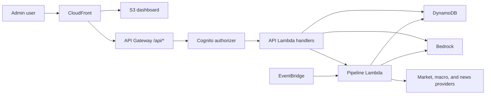

# SignalDesk AWS Architecture

SignalDesk has been ported from a local macOS/SQLite/FastAPI prototype to an AWS
serverless application.

The canonical architecture document is
[design/architecture.md](/Users/emilygao/LocalDocuments/Projects/signaldesk-aws/design/architecture.md).

## Current AWS Shape

| Layer | Implementation |
| --- | --- |
| Dashboard | S3 private bucket served by CloudFront |
| API | API Gateway REST API with Python Lambda handlers |
| Auth | Cognito private-admin user pool |
| Pipeline | Docker-image Lambda invoked manually or by EventBridge |
| Storage | Single-table DynamoDB |
| Secrets | AWS Secrets Manager |
| Settings and safety policy | AWS Systems Manager Parameter Store |
| AI | Amazon Bedrock in AWS mode, OpenAI retained for local/provider fallback |
| Observability | CloudWatch logs, API Gateway metrics, DynamoDB run status records, SQS DLQ for pipeline failures |

## High-Level Flow

See the design document for stack details, data model, API routes, deployment
flow, and safety controls.
