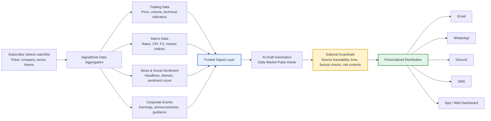
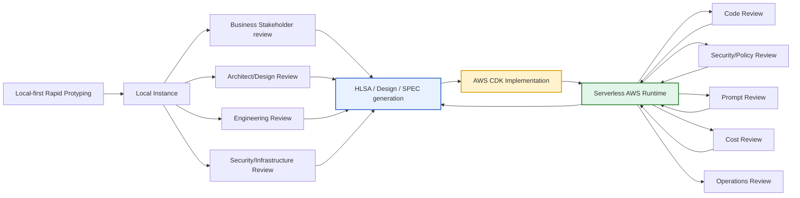

# Use Case: Personalized Market Pulse Articles for News/Media Subscribers

## Executive Summary

A News/Media company can use AI and automation to create **personalized, highly structured financial news coverage** for subscribers based on the stock tickers, companies, sectors, or themes they choose to follow.

This use case is best suited to **repeatable, data-driven editorial formats** where the story structure is consistent and the source data is trusted. It is not about allowing AI to perform original journalism. Instead, AI is used to generate a **first-pass daily market pulse article** from verified data, signals, and editorial templates, while human editors retain oversight of quality, tone, risk, and publication standards.

The current implementation has been ported to AWS. The product pattern described
below now maps to a serverless architecture using CloudFront, S3, Cognito, API
Gateway, Lambda, EventBridge, DynamoDB, Secrets Manager, SSM Parameter Store, and
Amazon Bedrock.

The model is similar to established automated journalism patterns, such as structured earnings stories and sports recaps, but extended into a personalized subscription product.

---

## Use Case Overview

Subscribers select the stock tickers or companies they want to follow. Each day, the SignalDesk-style application aggregates relevant market, macroeconomic, corporate, news, and sentiment signals, then generates a tailored article for each subscriber.

The generated article can be distributed through subscription channels such as:

- Email newsletters
- WhatsApp
- Discord
- SMS
- Mobile app notifications
- Subscriber dashboards

## AWS Solution Mapping

| Product capability | AWS implementation |
|---|---|
| Subscriber/admin dashboard | Static dashboard in S3 served through CloudFront |
| Private access | Cognito user pool for admin authentication |
| Watchlist and content APIs | API Gateway with Cognito-protected Lambda handlers |
| Daily market pulse generation | Docker-image Lambda pipeline |
| Scheduled generation | EventBridge rule, disabled by default until smoke tests pass |
| Manual generation | `/api/run` Lambda route invokes the pipeline Lambda |
| Run history and latest state | DynamoDB single-table model |
| External keys and webhooks | Secrets Manager |
| Model settings and policy | SSM Parameter Store |
| AI-assisted drafting | Amazon Bedrock with finance-only validation |
| Failure handling | CloudWatch logs, DynamoDB run status records, and SQS DLQ |

---

## Stakeholder Communication Diagram

---

## Example Scenario

A subscriber follows **AAPL, NVDA, and TSLA**.

Each morning, they receive a short personalized article summarizing what changed across their watchlist.

Example article structure:

| Section | Purpose |
|---|---|
| Market Snapshot | Price movement, volume, volatility, and technical indicators |
| Sentiment Pulse | News sentiment, social media signals, major recurring themes |
| Macro Context | Interest rates, inflation, market indices, sector pressure |
| Corporate Update | Earnings stories, announcements, analyst reactions, guidance |
| Daily Narrative | Plain-English interpretation of the key movement |
| Watchlist Alert | What materially changed since the previous update |
| Risk / Catalyst Watch | Near-term risks, events, or catalysts to monitor |

---

## Sample Output

> **Daily Market Pulse: NVDA remains strongly bullish after positive earnings sentiment and continued AI demand signals, while TSLA shows mixed momentum due to weaker technical indicators and recent negative news flow. Macro conditions remain neutral, with bond yields and inflation expectations largely unchanged.**

This output is not intended to replace market journalism or analyst commentary. It is a structured first-pass article generated from trusted signals and suitable for editorial review, personalization, and rapid subscriber distribution.

---

## Business Value

| Value Driver | Description |
|---|---|
| Faster Publishing | Routine financial updates can be generated quickly from structured data and trusted feeds |
| Personalization | Each subscriber receives coverage based on their own watchlist |
| Higher Engagement | Personalized, timely updates increase relevance and subscriber stickiness |
| Editorial Productivity | Journalists and editors spend less time on formulaic summaries and more time on analysis, interviews, and enterprise reporting |
| Consistency | Repeatable article templates improve quality and reduce variation across routine coverage |
| New Revenue Model | Enables premium market intelligence newsletters, alerts, and investor-focused subscription products |
| Multi-channel Distribution | The same core article can be adapted for email, WhatsApp, Discord, SMS, and app delivery |

---

## Operating Model

The recommended operating model separates deterministic signal generation from AI-generated narrative.

### Deterministic Layer

This layer should remain rules-based, auditable, and testable.

Examples:

- Subscriber watchlist management
- Market data ingestion
- Macro indicator ingestion
- News source selection
- Technical indicator calculation
- Sentiment scoring
- Signal weighting
- Source ranking
- Subscription routing
- Distribution channel selection
- Audit logging

In the AWS port, these deterministic concerns are handled by the pipeline Lambda,
provider contracts, DynamoDB persistence, and explicit run-status records.

### AI Layer

This layer should focus on language generation, summarisation, explanation, and channel adaptation.

Examples:

- First-pass article drafting
- Daily narrative generation
- Headline suggestions
- Summary generation
- Tone adaptation by audience segment
- Channel-specific formatting
- Explanation of key movements
- Drafting of short-form alerts

In the AWS port, AI generation is routed through the Bedrock provider by default.
Requests and model outputs are validated with typed schemas before generated
copy is returned or stored.

---

## Governance and Editorial Controls

The quality of this use case depends on trusted inputs, strong controls, and editorial oversight.

Recommended controls:

| Control Area | Recommended Practice |
|---|---|
| Source Governance | Use approved data providers and maintain source lineage |
| Signal Governance | Version scoring rules, weights, and thresholds |
| Editorial Oversight | Allow editors to review, approve, amend, or suppress AI-generated copy |
| Factual Traceability | Link every article back to the underlying market, macro, news, and earnings inputs |
| Confidence Scoring | Include confidence indicators for signals and generated narratives |
| Human-in-the-loop Review | Require review for high-impact, sensitive, or low-confidence articles |
| Audit History | Store generated drafts, prompts, source inputs, editorial changes, and final published versions |
| Channel Controls | Apply different approval thresholds for email, SMS, app alerts, or public publishing |

The implementation supports these controls through SSM-managed safety policy,
typed request/output validation, source-linked stored run payloads, and
structured API errors for rejected requests.

---

## Why This Use Case Works

This is a strong use case because it operates in a domain where:

1. The content format is repeatable.
2. The input data is structured or semi-structured.
3. The audience values timeliness and personalization.
4. The article is derived from observable market signals.
5. The output can be reviewed before publication.
6. Journalists are freed up for higher-value editorial work.

The strongest framing is:

> **Trusted data and deterministic signals generate the evidence base; AI turns that evidence into a personalized first-pass article; editors govern the final published narrative.**

---

## What This Is Not

This use case should not be positioned as:

- AI replacing journalists
- AI performing original market investigation
- AI publishing unsupported opinions
- AI inventing analysis without source evidence
- AI producing high-risk financial advice

It should be positioned as:

- AI-assisted structured journalism
- Personalized subscriber intelligence
- Automated first-pass market coverage
- Editor-governed content generation
- Data-driven publishing productivity

---

## MVP Scope

A practical MVP could include:

| Capability | MVP Scope |
|---|---|
| Subscriber Watchlist | Allow users to subscribe to selected stock tickers |
| Data Aggregation | Pull trading data, macro data, news headlines, and earnings-related updates |
| Signal Layer | Generate technical, sentiment, macro, and aggregate scores |
| Article Generation | Produce a daily market pulse article per subscriber or watchlist |
| Editorial Review | Provide a review queue for generated articles |
| Distribution | Send approved articles by email first, then extend to WhatsApp, Discord, SMS |
| Audit Trail | Store source inputs, generated drafts, final output, and distribution history |

The AWS MVP currently covers watchlist management, data aggregation, signal
generation, AI-assisted earnings/news draft generation, dashboard review, run
status tracking, and durable storage. Distribution channels beyond dashboard and
Discord webhook notification remain extension points.

---

## Success Metrics

| Metric | Measurement |
|---|---|
| Publishing Speed | Time from data availability to first draft |
| Editorial Efficiency | Reduction in time spent producing routine market updates |
| Subscriber Engagement | Open rates, click-through rates, read depth, retention |
| Personalization Value | Engagement uplift from personalized vs generic newsletters |
| Quality | Editor amendment rate, factual correction rate, approval rate |
| Trust | Source traceability coverage, audit completeness, subscriber feedback |
| Revenue | Premium subscription conversion and retention |

---

## One-line Summary

A News/Media company can use SignalDesk-style AI automation to deliver personalized daily market pulse articles for each subscriber’s watchlist, combining trusted financial data, macro signals, news sentiment, and corporate updates into fast, consistent, editor-governed coverage across subscription channels.

## Design Methodology
The design approach starts with a local-first prototype to quickly validate the product concept, data flows, user experience, and AI-assisted content generation pattern before committing to cloud implementation.

The working local instance became the review anchor for business stakeholders, architects, engineers, and security/infrastructure teams. Feedback from these reviews was converted into formal design artefacts, including high-level solution architecture, technical design, implementation specifications, and deployment plans.

The AWS build now proceeds through iterative delivery cycles. Each build increment is reviewed across code quality, security and policy controls, AI prompt behaviour, cost profile, and operational readiness. Findings are fed back into the implementation backlog and the design artefacts are continuously updated so that the architecture remains aligned with what is actually being built.

The key principle is:

- Prototype locally to validate the idea quickly; 
- Formalise the design before cloud build;  
- Keep implementation, reviews, and design artefacts evolving together.

