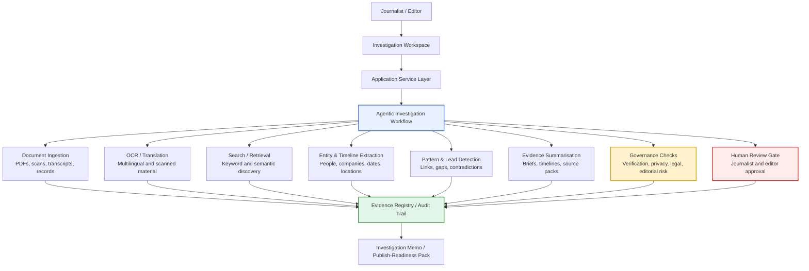

# Use Case: AI-Assisted Investigation Manager for Newsrooms

## Executive Summary

A News/Media company can adapt the existing **fraud-agentic-ai investigation framework** into an **AI-Assisted Investigation Manager** for journalists working on complex investigations.

The pattern is similar to fraud investigation: the AI does **not** make the final decision. Instead, it helps investigators process large information sets, retrieve relevant evidence, identify patterns, prepare case notes, and maintain an audit trail. Final editorial judgment remains with journalists and editors.

The core principle is:

> **AI accelerates discovery and organisation; journalists retain verification, interpretation, and final editorial judgment.**

---

## Newsroom Problem

Investigative teams often work with messy, fragmented, and multilingual material.

| Investigation Input | Example |
|---|---|
| Documents | PDFs, scanned files, leaks, court records, company filings |
| Multilingual evidence | Foreign-language reports, interviews, public records |
| Open-source material | News articles, social media posts, videos, images |
| Structured datasets | Procurement records, corporate registries, sanctions lists |
| Internal research notes | Reporter notes, source timelines, interview transcripts |

The challenge is not only volume. The challenge is finding what matters, linking it to the investigation hypothesis, and verifying it rigorously.

AI can improve productivity by surfacing relevant material faster, and improve quality by helping reporters find patterns, contradictions, and connections they may miss manually.

---

## Proposed Solution

The **AI-Assisted Investigation Manager** provides a governed investigation workspace where journalists can:

1. Upload or connect large document sets.
2. Run OCR and translation on difficult source material.
3. Search and retrieve relevant evidence.
4. Cluster documents by people, entities, locations, events, and themes.
5. Generate investigation briefs, timelines, and evidence maps.
6. Surface contradictions, gaps, and follow-up questions.
7. Track verification status and editorial review.
8. Produce audit-ready investigation notes and source traceability.

---

## Stakeholder Communication Diagram



---

## Reusing the Fraud-Agentic-AI Framework

The existing fraud-agentic-ai pattern can be reused because the underlying workflow is similar:

- A case or investigation is opened.
- Evidence is gathered from governed sources.
- AI assists with triage, summarisation, and hypothesis generation.
- Deterministic tools control data access and evidence handling.
- Human reviewers approve or reject outputs.
- Reports and run traces are persisted for auditability.

| Existing Fraud Framework Capability | Newsroom Investigation Adaptation |
|---|---|
| Fraud case dashboard | Investigation workspace |
| Alert / case intake | Investigation brief or research question intake |
| Fraud typology retrieval | Editorial policy, legal guidance, topic background, prior coverage retrieval |
| Case data tools | Document, source, registry, transcript, and OSINT tools |
| Evidence summariser | Investigation evidence brief |
| Signal hypotheses | Lead, pattern, anomaly, or contradiction hypotheses |
| Governance checks | Source reliability, verification, privacy, legal, and editorial risk checks |
| Human review interrupt | Editor or senior journalist review gate |
| Signal registry | Lead registry, evidence registry, source registry |
| Case report writer | Investigation memo, editorial brief, publish-readiness report |
| Run traces | Audit trail of evidence, prompts, outputs, and journalist decisions |

---

## Example Workflow

```text
Investigation question:
“Are public contracts linked to companies connected to a political donor network?”

        ↓

1. Intake investigation brief
        ↓
2. Ingest documents, public records, articles, social media, and videos
        ↓
3. OCR scanned files and translate foreign-language material
        ↓
4. Extract people, companies, dates, locations, payments, and relationships
        ↓
5. Retrieve related prior coverage and background material
        ↓
6. Surface patterns, anomalies, contradictions, and missing evidence
        ↓
7. Generate investigation brief and timeline
        ↓
8. Journalist verifies sources and evidence
        ↓
9. Editor reviews legal, privacy, source, and factual risk
        ↓
10. Produce publish-readiness pack or further-research brief
```

---

## Deterministic Layer vs AI Layer

The strongest design keeps evidence-processing controls deterministic and uses AI for summarisation, retrieval assistance, and reasoning support.

| Capability | Deterministic / Controlled | AI-Assisted |
|---|---|---|
| Document ingestion | Yes | No |
| OCR pipeline | Yes | Optional quality assist |
| Translation | Controlled provider | AI-supported, verified |
| Source metadata | Yes | No |
| Entity extraction | Validated extraction pipeline | AI-assisted, reviewed |
| Evidence retrieval | Search with citations | Semantic search support |
| Pattern surfacing | Scored and traceable | Hypothesis generation |
| Investigation judgment | Human only | No |
| Legal / editorial approval | Human only | No |
| Draft brief generation | Governed templates | Yes |
| Final publication | Editor controlled | No autonomous publishing |

---

## Governance and Editorial Controls

This use case only works if the newsroom treats AI outputs as **leads**, not facts.

| Control | Description |
|---|---|
| Source lineage | Every AI-generated claim links back to source documents or retrieved evidence |
| Verification status | Evidence marked as unverified, partially verified, verified, or rejected |
| Error measurement | OCR, translation, and extraction quality should be sampled and measured |
| Human review | Journalists and editors approve conclusions before publication |
| Legal / privacy review | Sensitive personal information, minors, protected sources, and defamation risk require review |
| Prompt and output audit | Store prompts, retrieved evidence, generated summaries, and editor changes |
| Confidence scoring | Low-confidence translations, OCR results, or entity matches are flagged |
| Non-publication boundary | AI can prepare investigation packs, but cannot publish or make final claims |

---

## Business Value

| Value Driver | Benefit |
|---|---|
| Faster document review | Reporters can triage thousands of documents more quickly |
| Better multilingual investigation | OCR, translation, and semantic search make difficult document sets more usable |
| Pattern discovery | AI can surface relationships, repeated entities, timeline gaps, and contradictions |
| Workflow efficiency | Investigation notes, briefs, and timelines are generated faster |
| Higher editorial quality | Reporters can spend more time verifying, interviewing, and interpreting |
| Reusable investigation IP | Repeatable workflows for procurement, conflict-of-interest, sanctions, war reporting, corporate accountability, and public records investigations |
| Auditability | The newsroom can show how evidence was found, reviewed, and verified |

---

## MVP Scope

| MVP Capability | Description |
|---|---|
| Investigation intake | Journalist enters research question, topic, and known entities |
| Document ingestion | Upload PDFs, text files, transcripts, articles, and public records |
| OCR and translation | Process scanned and multilingual documents |
| Evidence search | Semantic and keyword search across investigation material |
| Entity extraction | Identify people, organisations, locations, dates, events, and payments |
| Timeline builder | Create a draft chronology from source material |
| Evidence brief | Generate a structured investigation memo with source references |
| Review queue | Mark findings as verified, rejected, or requiring follow-up |
| Audit trail | Store evidence links, generated outputs, edits, and decisions |

---

## Success Metrics

| Metric | Measurement |
|---|---|
| Time to first evidence brief | How quickly reporters receive a useful initial investigation pack |
| Document review productivity | Number of documents triaged per journalist per day |
| Evidence relevance | Percentage of surfaced materials judged useful by reporters |
| Verification quality | Error rate in OCR, translation, entity extraction, and summaries |
| Editorial efficiency | Reduction in manual time spent organising notes and timelines |
| Investigation depth | Number of new leads, relationships, or contradictions surfaced |
| Audit completeness | Percentage of generated claims linked to source evidence |

---

## Positioning Statement

This use case should be positioned as:

- AI-assisted structured investigation support
- A governed evidence discovery and workflow manager
- A productivity layer for investigative teams
- A quality-control layer for source traceability and verification
- A reusable newsroom investigation accelerator

It should **not** be positioned as:

- AI replacing journalists
- AI making final editorial judgments
- AI publishing investigative claims
- AI generating unsupported conclusions
- AI bypassing legal or editorial review

---

## One-Line Summary

A News/Media company can adapt the fraud-agentic-ai framework into an **AI-Assisted Investigation Manager** that helps journalists process messy documents, multilingual evidence, social media, news reports, and videos faster, while preserving source traceability, verification discipline, editorial oversight, and final human judgment.
