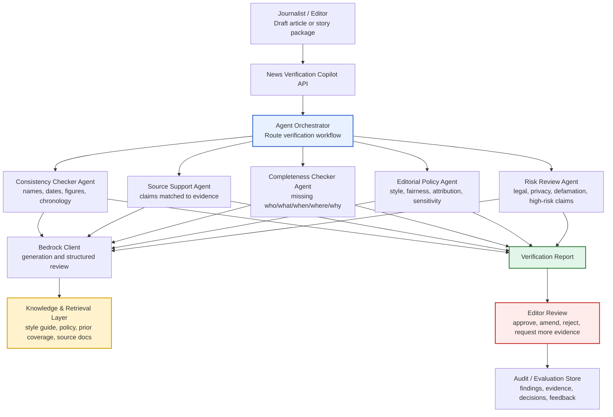
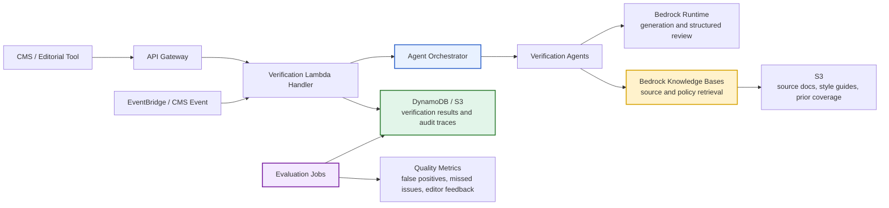

# Use Case: AI Copilot for News Verification

## Executive Summary

**AI Copilot for News Verification**: a newsroom assistant that helps editors and journalists check consistency, completeness, sourcing, and factual risk before publication.

This use case is quality-oriented rather than content-generation-oriented. The copilot does **not** make final editorial calls and does **not** autonomously publish. Instead, it supports editors by flagging potential issues, surfacing source context, identifying contradictions, checking missing details, and preparing a structured verification brief.

The strongest positioning is:

> **AI flags possible verification issues; editors decide what is true, complete, fair, and publishable.**

---

## Newsroom Problem

Newsrooms face constant pressure to publish quickly while maintaining editorial quality. Verification work is often repetitive, time-sensitive, and detail-heavy.

Common verification pain points include:

| Pain Point | Example |
|---|---|
| Contradictions | Article says one number in the headline and another in the body |
| Missing details | Who, what, when, where, why, or source attribution is incomplete |
| Inconsistent naming | Person, organisation, location, title, or date appears differently across the article |
| Unsupported claims | A strong claim is made without a linked source or evidence |
| Stale information | Draft references old figures, superseded statements, or outdated context |
| Translation risk | Foreign-language source material may be misinterpreted |
| Repetitive manual checks | Editors repeatedly check names, dates, numbers, references, and quote consistency |

AI is useful here because the work is structured, repeatable, and assistive. The copilot can quickly inspect drafts and supporting material, but final judgment remains with the newsroom.

---

## Proposed Solution

The **AI Copilot for News Verification** reviews a draft article and related source material, then produces a structured verification report for journalists and editors.

The copilot can:

1. Check internal consistency across headline, standfirst, body, captions, and metadata.
2. Identify unsupported or weakly supported claims.
3. Compare article claims against retrieved source material.
4. Flag missing attribution, unclear sourcing, or ambiguous wording.
5. Detect inconsistent names, dates, figures, locations, and chronology.
6. Highlight possible legal, privacy, or editorial sensitivity.
7. Produce a verification checklist and editor-facing review summary.
8. Store the verification trace for audit and continuous improvement.

---

## Reusing the aws-genai-airlab Copilot Framework

The aws-genai-airlab project already provides a useful pattern for this use case:

- A Python-based AWS GenAI lab using Amazon Bedrock, Bedrock Knowledge Bases, S3-backed vector retrieval, event-triggered AI invocation, and task-specific agent workflows.
- A shared Bedrock client for text generation, retrieval, and retrieve-and-generate access.
- An agent router that routes named workflows to task-specific agents.
- API-compatible Lambda wrappers for task-specific flows.
- Trigger rules, schema validation, audit records, and evaluation utilities.

This can be adapted into a newsroom verification copilot.

| aws-genai-airlab Capability | News Verification Adaptation |
|---|---|
| `BedrockClient` | Shared generation and retrieval client for verification tasks |
| Bedrock Knowledge Bases | Retrieval over editorial policies, style guides, previous coverage, trusted sources, and source documents |
| Agent orchestrator | Routes verification tasks to specialist agents |
| Tutor agent pattern | Grounded prompt assembly using article, retrieved context, and source evidence |
| Reviewer agent pattern | Scores article quality, risks, and recommendations |
| Lambda handlers | API endpoints for CMS or newsroom workflow integration |
| Trigger stack | Event-triggered verification when article status changes |
| Schema validation | Ensures draft/article/source payloads are complete before review |
| Audit records | Stores verification findings, model outputs, and review traces |
| Evaluation utilities | Measures verification quality, false positives, and missed issues |

---

## Stakeholder Communication Diagram



---

## Example Workflow

```text
Draft article enters verification queue
        ↓
Payload validation checks article structure and required metadata
        ↓
Copilot retrieves relevant context:
- source documents
- editorial policy
- style guide
- previous coverage
- trusted reference material
        ↓
Specialist verification agents run:
- consistency check
- source support check
- completeness check
- policy and sensitivity check
- risk review
        ↓
Copilot generates structured verification report
        ↓
Editor reviews flagged issues
        ↓
Editor approves, amends, rejects, or requests more evidence
        ↓
Audit trace and feedback are stored for quality improvement
```

---

## Example Verification Report Structure

| Section | Purpose |
|---|---|
| Overall Verification Status | Ready, needs review, high risk, or blocked |
| Key Issues Found | Short list of material issues |
| Consistency Findings | Names, numbers, dates, chronology, and terminology issues |
| Source Support Findings | Claims that need evidence or attribution |
| Missing Details | Incomplete context, unanswered questions, missing source metadata |
| Editorial Policy Findings | Style, tone, attribution, balance, or sensitivity issues |
| Risk Flags | Legal, privacy, defamation, safety, or reputational risk indicators |
| Suggested Editor Actions | Practical next steps for review |
| Evidence Links | References to source documents, passages, or retrieved context |
| Audit Metadata | Model version, prompt version, retrieval profile, timestamp, reviewer decision |

---

## Deterministic Layer vs AI Layer

The best implementation keeps workflow controls deterministic and uses AI for assisted review.

| Capability | Deterministic / Controlled | AI-Assisted |
|---|---|---|
| Article intake | Yes | No |
| Payload schema validation | Yes | No |
| CMS status trigger | Yes | No |
| Source document indexing | Yes | No |
| Retrieval profile selection | Yes | No |
| Style guide / policy lookup | Yes | Retrieval-assisted |
| Consistency checks | Rule-based where possible | AI-assisted for language/context |
| Source support matching | Evidence-linked retrieval | AI-assisted claim comparison |
| Risk classification | Controlled taxonomy | AI-assisted risk explanation |
| Verification report generation | Structured template | AI-assisted drafting |
| Final editorial decision | Human only | No |
| Publication | CMS/editor controlled | No autonomous publishing |

---

## Suggested Agent Design

A practical MVP can start with five task-specific verification agents.

| Agent | Responsibility |
|---|---|
| Consistency Checker Agent | Finds mismatched names, dates, titles, figures, quotes, and chronology |
| Source Support Agent | Checks whether major claims are supported by source material |
| Completeness Checker Agent | Flags missing attribution, context, or unanswered basic reporting questions |
| Editorial Policy Agent | Reviews against style guide, attribution rules, fairness guidance, and sensitivity rules |
| Risk Review Agent | Flags legal, privacy, defamation, safety, or high-impact claim risks |

The agent orchestrator can route all stories through a default verification workflow, or apply different workflows based on story type, desk, geography, risk level, or publication channel.

---

## AWS Reference Architecture

The use case can be implemented using the aws-genai-airlab architecture pattern.



---

## Governance and Editorial Controls

This use case must be designed as a **verification assistant**, not a final authority.

| Control | Description |
|---|---|
| Human editorial decision | Editors approve, amend, reject, or ignore AI findings |
| Evidence-linked findings | Each issue should link back to article text, source text, or policy reference |
| Prompt and retrieval versioning | Store prompt version, retrieval profile, model ID, and policy version |
| Risk taxonomy | Use controlled categories for legal, privacy, source, and factual risk |
| Confidence and severity | Findings should include severity, confidence, and recommended action |
| Audit trail | Store draft ID, findings, evidence references, editor actions, and timestamps |
| Feedback loop | Capture whether editor accepted, rejected, or modified each finding |
| Evaluation set | Maintain benchmark stories to measure false positives and missed issues |
| Non-publication boundary | The copilot cannot publish or block publication without human workflow rules |

---

## Business Value

| Value Driver | Benefit |
|---|---|
| Faster verification | Routine checks can be completed before editor review |
| Higher content quality | Contradictions, missing details, and unsupported claims are surfaced earlier |
| Better consistency | Names, dates, numbers, captions, and metadata are checked systematically |
| Reduced editorial load | Editors spend less time on repetitive checks and more time on judgment |
| Improved speed-to-market | Stories can move through review faster without removing editorial control |
| Stronger governance | Verification traces support accountability and continuous improvement |
| Reusable newsroom capability | The same pattern can support breaking news, investigations, business reporting, and multilingual desks |

---

## MVP Scope

| MVP Capability | Description |
|---|---|
| Draft article intake | Accept article text, headline, metadata, desk, author, and source references |
| Source upload / retrieval | Connect draft to source documents, prior coverage, and style guide material |
| Consistency checker | Detect mismatches in dates, names, numbers, titles, and chronology |
| Source support checker | Flag unsupported claims and weak attribution |
| Missing detail checker | Identify missing context or incomplete reporting basics |
| Verification report | Generate a structured report for editor review |
| Editor feedback | Capture accepted, rejected, and amended findings |
| Audit storage | Persist verification result, model metadata, retrieval context, and review decisions |
| Basic evaluation | Track false positives, accepted findings, and repeated issue types |

---

## Success Metrics

| Metric | Measurement |
|---|---|
| Verification turnaround time | Time from draft submission to verification report |
| Accepted findings rate | Percentage of AI findings accepted by editors |
| False positive rate | Percentage of findings rejected as not useful |
| Missed issue rate | Issues later found by editors but missed by the copilot |
| Consistency improvement | Reduction in name, date, number, and attribution errors |
| Editorial productivity | Reduction in repetitive checking effort |
| Speed-to-market | Reduction in time from draft-ready to publish-ready |
| Audit completeness | Percentage of findings linked to evidence, policy, or article passage |

---

## Implementation Phases

### Phase 1: Local Copilot Prototype

- Reuse the agent orchestrator pattern.
- Create a `verification_agent` workflow.
- Use local sample articles, style guides, and source documents.
- Generate structured verification reports.
- Capture editor feedback manually.

### Phase 2: AWS Serverless MVP

- Expose verification workflow through API Gateway and Lambda.
- Use Bedrock Runtime for generation.
- Use Bedrock Knowledge Bases for policy, style guide, prior coverage, and source retrieval.
- Store verification results and audit traces in DynamoDB or S3.
- Trigger verification from CMS workflow events.

### Phase 3: Evaluation and Governance

- Build a benchmark set of previously reviewed articles.
- Measure accepted findings, missed issues, and false positives.
- Version prompts, policies, retrieval profiles, and model IDs.
- Add dashboard reporting for quality metrics and recurring issue types.

---

## One-Line Summary

A News/Media company can reuse the aws-genai-airlab copilot framework to build an **AI Copilot for News Verification** that flags contradictions, unsupported claims, missing details, and editorial risks before publication, while keeping editors in full control of verification and final publishing decisions.
